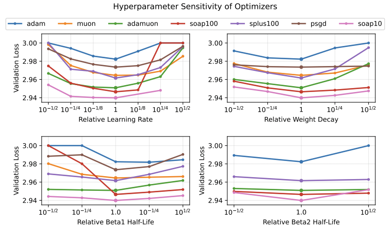

## What really matters in matrix-whitening optimizers?

This is the code repo that goes along with our paper, ["What really matters in matrix-whitening optimizers? (Frans, Abbeel, Levine.)"](https://arxiv.org/abs/2510.25000). We also encourage you to read the lightweight [blog post](https://kvfrans.com/matrix-whitening/) which has some nice visualizations.

This code itself is a way to exactly reproduce the results in the paper. Specifically, we train a GPT-2 style Transformer on the OpenWebText dataset. When considering different optimizer families, we tune the learning rate, weight decay, beta1, and beta2 terms. Otherwise, we train for 10000 steps, with a batch size of 1024 and a sequence-length of 256, and use a warmup of 200 steps followed by cosine decay. All runs are initialized from the same random seed.

Notably, we also treat all nonstandard parameters in the same way. For all layernorm, embedding, and output parameters, we use an Adam optimizer with fixed hyperparameters. This enables a fair comparison and only considers the effects of the various optimizers on the *dense layers*. We also utilize a minimal implementation of the optimizers whenever possible, i.e. no Nesterov momentum, learning rate grafting, or iterate averaging.

We've tuned all the optimizer families to locate their optimal hyperparameters. You can see these in `best_params.py`. To run the code yourself, please see `run_baselines.py` for a script that will generate the relevant commands. See `env/` for a typical conda environment to run the codebase.

The following optimizers are implemented:
- Adam (Kingma & Ba, 2014), a baseline optimizer that is the current standard for training deep neural networks. Updates are normalized by an elementwise second moment buffer.
- Signum (Bernstein et al., 2018), which updates via the elementwise sign rather than normalizing by second-moment.
- Shampoo (Gupta et al., 2018; Shi et al., 2023), a matrix optimizer which explicitly tracks Kronecker factors as in Equation (5). Every N gradient steps, the left and right preconditioners are calculated by raising each factor to the −(1/4) matrix power, and this result is cached until the next recalculation. We consider N ∈ {10, 100}.
- SOAP (Vyas et al., 2024), a variant of Shampoo where updates are rotated onto the eigenbasis of the left/right factors. In this rotated space, the updates are normalized via an elementwise uncentered variance (i.e. an inner Adam update), then rotated back.
- SPlus (Frans et al., 2025), which similarly to SOAP rotates updates onto the eigenbasis, but takes the elementwise sign rather than normalizing by an explicit second moment buffer.
- Muon (Jordan et al., 2024), which orthogonalizes updates via Newton-Shulz iteration, and can be seen as descending under the spectral norm.
- AdaMuon (Si et al., 2025), a variant on Muon where a variance buffer is estimated over post-orthogonalized updates, and is used for elementwise normalization. We use a simplified form of the original algorithm that does not use the pre-NS sign transformation. Also concurrently proposed as NorMuon (Li et al., 2025).
- PSGD (Fisher-Kron) (Li, 2017; 2018), which keeps track of a left/right preconditioner that is learned via iterative gradient descent. We update the precondioner at every step.